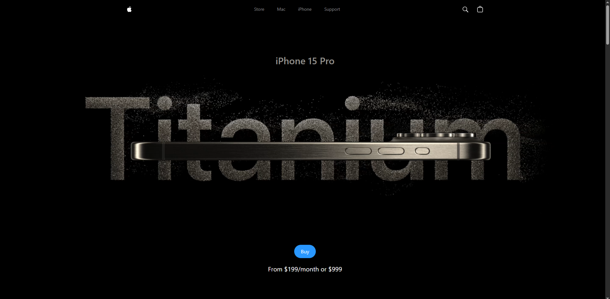

# 3D Apple Website

An immersive 3D product showcase website inspired by Apple, built using **React.js**, **Three.js**, and **GSAP** for smooth transitions and animations.

---

## 🚀 About The Project

This website replicates a high-quality 3D Apple-like product landing experience. It demonstrates my skills in building interactive 3D web environments using **React Three Fiber** and **GSAP**.

💡 Features:
- Interactive 3D model rendering using Three.js.
- Smooth animations and transitions powered by GSAP.
- Responsive design for desktop and mobile.
- Clean UI mimicking real-world product websites.

---

## 🖼️ Screenshots

---

## ⚙️ Tech Stack

- React.js
- Three.js
- @react-three/fiber
- GSAP
- Tailwind CSS 

---

## 💻 Setup & Run Locally

1. Install dependencies:
   npm install

2. Start the development server:
   npm run dev
   
3.Open: http://localhost:3000 
